# 📚 Young Book Lovers Dating Club — Team 3: "Book Catalog and Analytics"

A console Java application that demonstrates **twelve classic design patterns** (GoF) using the example
of a service that introduces young people (aged 14–30) to each other based on their reading interests.

The original project had 9 patterns. **Team 3** added three new patterns (the code stays in a single `src/Main.java`):
**Flyweight**, **Visitor** and **Template Method**.

## Features

- Registration with a chain of validation checks (name, age, favorite genres, contact).
- Adding books a user has read by ISBN, taken from a "legacy" city library catalog.
  Each book exists **once** in memory; ratings and dates are stored per user. *(new)*
- A profile view with reading statistics, the last book read and a verification badge.
- Matchmaking by genres, by authors, by age and city, or by a weighted combination of all three.
- Notifications about new matches and club meetups via E-mail, Telegram or SMS.
- Club statistics (popular genres, age statistics, top authors) and reports in
  text, CSV and Markdown formats. *(new)*

## Design Patterns

| # | Pattern | Category | Where | Why |
|---|---------|----------|-------|-----|
| 1 | Singleton | Creational | `UserRepository` | One shared, thread-safe user storage for the whole application |
| 2 | Builder | Creational | `User.Builder` | Readable creation of a profile with many optional fields |
| 3 | Factory Method | Creational | `NotifierFactory` | Creates the right notifier for the user's contact channel |
| 4 | Adapter | Structural | `LegacyCatalogAdapter` | Connects an old library catalog with an incompatible API |
| 5 | Decorator | Structural | `ProfileView` and its decorators | Adds badges and statistics to a profile at runtime |
| 6 | Facade | Structural | `BookLoversClub` | A single simple entry point that hides the subsystems |
| 7 | Strategy | Behavioral | `MatchStrategy` and implementations | Interchangeable matchmaking algorithms |
| 8 | Observer | Behavioral | `ClubEventBus`, `UserSubscriber` | Broadcasting club events to subscribers |
| 9 | Chain of Responsibility | Behavioral | `RegistrationValidator` | Sequential, easily extendable registration checks |
| 10 | **Flyweight** ⭐ | Structural | `BookFlyweightFactory`, `ReadingRecord` | The same book read by many users is stored as one shared object |
| 11 | **Visitor** ⭐ | Behavioral | `ClubVisitor` + 3 visitors, `User.accept`, `Book.accept` | Statistics without adding reporting code to the model classes |
| 12 | **Template Method** ⭐ | Behavioral | `ClubReport` + 3 subclasses | One fixed report skeleton, different output formats |

### The three new patterns

**Flyweight — `BookFlyweightFactory`.** `LegacyCatalogAdapter` used to call `new Book(...)` on every lookup.
Now it asks the factory, which keeps a `Map<ISBN, Book>` and returns the existing object.
- *Intrinsic state* (shared, immutable): ISBN, title, author, genre → `Book`.
- *Extrinsic state* (per user): rating and date read → `ReadingRecord`, stored in `User`.
- The demo proves it with `==` and prints how many `Book` objects were really created.

**Visitor — `ClubVisitor`.** `User` and `Book` got one method, `accept(ClubVisitor)`.
`User.accept` visits the user, then every book they read (so `visitBook` is called once per *read*).
- `GenrePopularityVisitor` – most popular genres
- `AgeStatisticsVisitor` – average / min / max age
- `TopAuthorsVisitor` – top 3 authors by number of reads
- `ClubStatistics` runs the three visitors over all users and is the single data source for reports.

**Template Method — `ClubReport`.** `final String generate()` calls `header()`, `body()`, `footer()` in a fixed order.
`TextReport`, `CsvReport` and `MarkdownReport` implement the steps. `title()` is an optional hook.
The data always comes from the visitors.

### How the patterns work together

- The **Facade** (`BookLoversClub`) is the only class `main` needs to talk to. New methods:
  `findBook`, `addReadBook(user, isbn, rating, date)`, `bookObjectsCreated`, `collectStatistics`, `generateReport`.
- On registration the Facade runs the **Chain of Responsibility**, saves the user into the
  **Singleton** repository and subscribes them to events through the **Observer**.
- Each subscriber gets its notifier from the **Factory Method**.
- Books come from the old catalog through the **Adapter**, which now gets them from the **Flyweight** factory.
- `ClubStatistics` walks **Visitors** over the users stored in the **Singleton** repository.
- `ClubReport` (**Template Method**) renders what the **Visitors** collected; `generateReport` is exposed by the **Facade**.
- Matching is done by a pluggable **Strategy**; profiles are rendered by stacking **Decorators**.

## Class diagram (new patterns)

```mermaid
classDiagram
    class BookLoversClub {
        +findBook(String) Optional~Book~
        +addReadBook(User, String, int, LocalDate)
        +bookObjectsCreated() int
        +collectStatistics() ClubStatistics
        +generateReport(Function) String
    }

    %% ---------- Flyweight ----------
    class BookFlyweightFactory {
        -pool Map~String, Book~
        +getBook(isbn, title, author, genre) Book
        +createdCount() int
    }
    class Book {
        <<flyweight, immutable>>
        -isbn
        -title
        -author
        -genre
        +accept(ClubVisitor)
    }
    class ReadingRecord {
        <<extrinsic state>>
        -rating int
        -dateRead LocalDate
    }
    class User {
        +accept(ClubVisitor)
        +addReading(ReadingRecord)
    }
    class LegacyCatalogAdapter

    BookLoversClub --> LegacyCatalogAdapter
    LegacyCatalogAdapter --> BookFlyweightFactory
    BookFlyweightFactory o--> "0..*" Book : pool
    User *--> "0..*" ReadingRecord
    ReadingRecord --> Book : shared

    %% ---------- Visitor ----------
    class ClubVisitor {
        <<interface>>
        +visitUser(User)
        +visitBook(Book)
    }
    class GenrePopularityVisitor
    class AgeStatisticsVisitor
    class TopAuthorsVisitor
    class ClubStatistics {
        +collect(Collection~User~)$ ClubStatistics
    }
    ClubVisitor <|.. GenrePopularityVisitor
    ClubVisitor <|.. AgeStatisticsVisitor
    ClubVisitor <|.. TopAuthorsVisitor
    User ..> ClubVisitor : accept
    Book ..> ClubVisitor : accept
    ClubStatistics o--> GenrePopularityVisitor
    ClubStatistics o--> AgeStatisticsVisitor
    ClubStatistics o--> TopAuthorsVisitor
    BookLoversClub --> ClubStatistics

    %% ---------- Template Method ----------
    class ClubReport {
        <<abstract>>
        +generate() String final
        #header() String
        #body() String
        #footer() String
        #title() String
    }
    class TextReport
    class CsvReport
    class MarkdownReport
    ClubReport <|-- TextReport
    ClubReport <|-- CsvReport
    ClubReport <|-- MarkdownReport
    ClubReport --> ClubStatistics : data from visitors
    BookLoversClub ..> ClubReport
```



## Project structure

All code lives in a single file, `src/Main.java` (like the original project). Inside it the code is
grouped into clearly marked sections, one per pattern group:

```
BookLoversClub/
├── README.md
├── DEFENSE_NOTES.md
└── src/
    └── Main.java      Main (demo) + all classes, in this order:
                       model · Singleton · Factory/Observer · Strategy · Decorator ·
                       Chain of Responsibility · Adapter + Flyweight ⭐ · Visitor ⭐ ·
                       Template Method ⭐ · Facade
```

## How to run

Requires **Java 11 or later**.

```bash
cd src
javac -encoding UTF-8 Main.java
java -Dfile.encoding=UTF-8 Main
```

Or run it directly without compiling (Java 11+):

```bash
java src/Main.java
```

On Windows, run `chcp 65001` first if emoji or special characters are not displayed correctly.

## Demo (what `Main` prints)

Sections 1–6 are the original demo (all 9 existing patterns still work). New sections:

- **7. Flyweight** – five users read overlapping books; `lookup1 == lookup2 -> true`,
  `aigerimsBook == armansBook -> true`; 14 reading records but only 7 `Book` instances.
- **8. Visitor** – genre popularity, age statistics (members, average, min, max) and top 3 authors.
- **9. Template Method** – the same statistics as a text, CSV and Markdown report.

```
Reading records (user + rating + date): 14
Distinct Book instances in memory     : 7
Book objects created by the factory   : 7 (from 16 requests)
   1 instance, 4 reader(s): The Master and Margarita
```

## Ideas for extension

- Add unit tests with JUnit 5.
- New report format (HTML, JSON): create a new `ClubReport` subclass; no existing class changes.
- New statistic (average rating per genre): create a new `ClubVisitor`; `User` and `Book` stay as they are.
